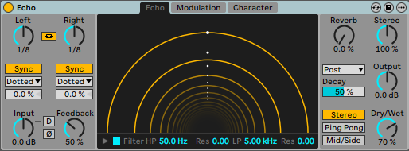
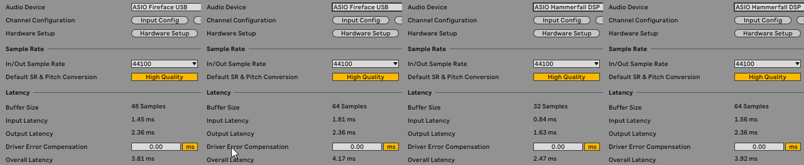
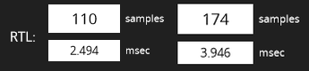
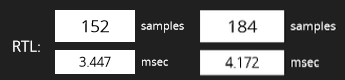
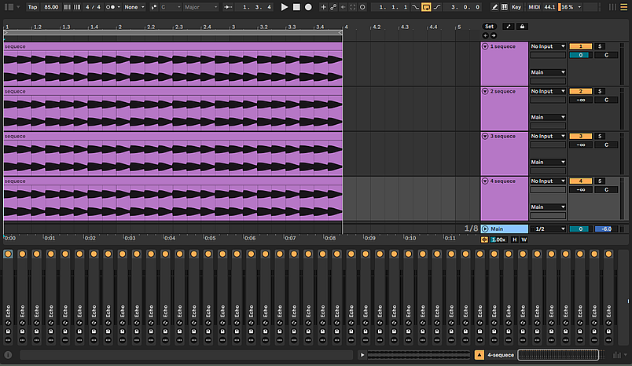
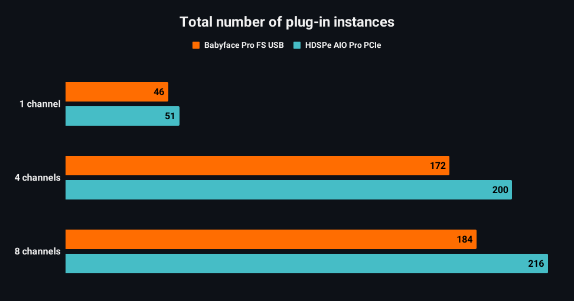
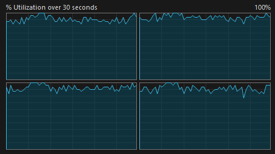
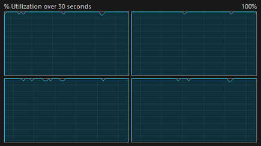
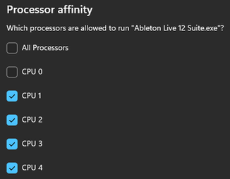
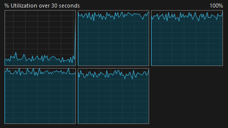

# Ableton Live 12
# RME PCIe, USB and Graphics low-latency performance

*Originally published on [Gearspace](https://gearspace.com/board/ableton-live/1460768-rme-pcie-usb-graphics-low-latency-performance-high-cpu-load-context-ableton-live-12-a.html), February 2026.*

<sub>*Disclaimer : Computer audio low-latency load testing is a context-sensitive activity, with significant variability in real-time performance - influenced by the version of the operating system and of the device drivers installed. These tests comprise a specific set of configurations that originate the findings shared in this post.*</sub>

## Test Objective
Assess low-latency performance at high CPU load in Ableton Live 12 and Windows 11 25H2
- AMD vs NVIDIA vs Intel UHD Graphics
- PCIe vs USB 2.0

## Test Methodology
Progressively load Ableton 12 audio track with an increasing number of plug-in instances.
The test results are measured quantitatively, by the maximum number of plug-in instances possible at the edge of audible dropouts/glitching artifacts.
Solely audio tracks - using a custom audio clip with staccato timing cues to allow the perceptual intelligibility of real-time audio engine dropouts (caused by the buffer processing time overtaking the time it takes to play it). The test plug-in used for this purpose effect was Live's built-in *Echo*. It provides a good balance between CPU load and granularity when adding up the effects count. The resulting audio was recorded externally into laptop connected to both interface outputs.

\
<sub>*Live's built-in Echo modulation delay effect*</sub>

## Test System

Somewhat aged but still reliable and performant : Coffee Lake i7 8700K / 16 GB RAM with Windows 11 25H2. A minimal number of connected peripherals - One NVMe SSD storage, graphics card, and sound interfaces. Power plan set to *Ultimate Performance*. Other tweaks include C-States off and Virtualization-based Security (VBS) disabled. 

The CPU configuration was modified for easier analysis - restricting the active CPU to 4 physical cores (No *Hyper-Threading*), allowing the system to reach an earlier ceiling, without having to exhaustively multiply the plug-in count to unreasonable amounts. CPU *Turbo* was kept on, and *Sync All cores* option locked to a ratio multiplier of 4300 MHz.

### Graphics Adapters

- Intel UHD Graphics 630 `31.0.101.2140`
- NVIDIA GeForce RTX 5060 Ti 8 GB `Studio Driver - WHQL 591.74`
- AMD RX 6400 4 GB `Adrenalin 25.12.1 WHQL`

### DPC latency measurements

| Adapter | Latency range | Max. latency |
|---:|---:|---:|
|Intel UHD 630/AMD RX 6400|5-10 μs|20 μs|
|NVIDIA 5060 Ti| 5-150 μs|160 μs|

<sub>**set to maximum power performance; Message Signaled Interrupts (MSI) automatically set for AMD and NVIDIA*</sub>

Readings were made over a 60-second interval.

### Sound Cards

* RME HDSPe AIO Pro PCIe 1.1 x1
* RME Babyface Pro FS USB 2.0

<sub>*For increased test coverage, AIO Pro was installed in both PCIe slots (x16 lane slot direct to CPU, and x1 slot to PCH) - no significant differences in performance were observed.*</sub>

### RME Settings

* `Optimize Multi-Client Mixing` disabled to maximize CPU usage
* `MMCSS` enabled as it displayed superior performance in certain contexts

<sub>*Results may vary with other DAWs. When the computer is overloaded to the point of graphics slowdown (with all cores utilized, close to 100%), it has diminishing returns - MMCSS ASIO thread deprioritization will happen more often (26 real-time down to 4-7) and at greater time lengths past a certain load threshold.*</sub>

### ASIO Buffer Size

| Soundcard | Buffer size |
|---:|---:|
|RME HDSPe AIO Pro|32 samples|
|RME Babyface Pro FS|48 samples|

<sub>*Tests were also run at a more level playing field of 64 samples, but results suggested differences are more pronounced at the lowest available buffer sizes.*</sub>

\
<sub>*Round-trip latency values reported by the driver for Babyface and AIO Pro, as shown in Live's preferences audio tab*</sub>
<br/><br/>

<br>
<sub>*32 & 64 samples round-trip latency values reported by oblique audio RLT utility for AIO Pro*</sub>
<br/><br/>

<br>
<sub>*32 & 64 samples round-trip latency values reported by oblique audio RLT utility for Babyface Pro FS</sub>
<br/><br/>

Strictly looking at round-trip latency values, we can see the PCIe AIO Pro holds just a very small advantage at 64 samples, while Babyface's latency @48 samples falls approximately between the 32 and 64 sample values of the PCIe card.

## Testing Procedure

- Single-Core load : A single audio track, progressively loaded with plug-in instances until audible dropouts occurred.
- Balanced per-core load  : Same as previous, but with 4 and 8 tracks, to evenly allocate the load across the 4 active CPU cores.

\
<sub>*The 4-channel project in Ableton Live*</sub>

## Results and Insights

### PCIe and USB 2.0

Using the AMD graphics card as reference - The PCIe AIO Pro allowed dropout-free playback at a higher number of plug-in instances, while Babyface Pro FS performance hit an earlier ceiling, with an average of 5 fewer instances per track. It is crucial to understand the test subjectivity of the plug-in count measurement being wildly dependent on the CPU load taken by single instance. One VST that hogs a lot of resources could result in little to zero difference in numbers, if the granularity isn't low enough. In contrast, a plug-in with very low CPU requirements like Ableton Live's compressor, would greatly magnify the count difference because more units are required to reach the same CPU utilization.

As side note, setting Ableton process affinity to exclude `CPU 0` has positive effects on the single channel test, possibly leaving the software free from the core where most interrupts are registered. Detrimental effects were seen for the remaining tests, where all cores are fully utilized - because there would be one fewer processor to distribute the processing load

\
<sub>*Total number of plug-in instances across the three projects*</sub>

#### 1 channel

Babyface
<audio controls>
  <source src="audio/1%20channel%20Babyface%20AMD.mp3" type="audio/mpeg">
</audio>
HDSPe AIO Pro
<audio controls>
  <source src="audio/1%20channel%20AIO%20AMD.mp3" type="audio/mpeg">
  Your browser does not support the tag.
</audio>

#### 4 channels

Babyface
<audio controls>
  <source src="audio/4%20channel%20Babyface%20AMD.mp3" type="audio/mpeg">
  Your browser does not support the tag.
</audio>
HDSPe AIO Pro
<audio controls>
  <source src="audio/4%20channel%20AIO%20AMD.mp3" type="audio/mpeg">
  Your browser does not support the tag.
</audio>

#### 8 channels

Babyface
<audio controls>
  <source src="audio/8%20channel%20Babyface%20AMD.mp3" type="audio/mpeg">
  Your browser does not support the tag.
</audio>
HDSPe AIO Pro
<audio controls>
  <source src="audio/8%20channel%20AIO%20AMD.mp3" type="audio/mpeg">
  Your browser does not support the tag.
</audio>
<br>
When listening audio clips, recall they were recorded at the plug-in instance count specified above. Comparing AIO Pro with the Babyface Pro FS clips would be useless, because they differ in the number of instances. At the higher PCIe count, the USB interface would be incurring in heavy artifacts. I decided to capture these clips at the point where artifacts started to be audible - but note this is a <ins>broad range</ins> - artifacts appear first at a lower rate of clicking noises or a sporadic glitch. As the plug-in count is raised, artifacts increase until the point of breakup, reaching a stage where original sound is severely mangled.

\
<sub>*% CPU utilization in Task Manager running the 8 channel project in Ableton Live, with Babyface Pro FS USB 2.0*</sub>
<br><br>

\
<sub>*% CPU utilization in Task Manager running the 8 channel project in Ableton Live, with HDSPe AIO Pro PCIe*</sub>

Looking up at both images, we can infer that the PCIe interface enables a greater maximum potential utilization of the CPU, when compared to the USB 2.0 RME Babyface Pro FS.

### Graphics Cards

Babyface Pro FS appeared to be less resilient to graphics card interchange, with remarkably worse performance using Intel HD integrated graphics and NVIDIA. Possible causes for Intel UHD include system resource RAM sharing that starves the bandwidth at very high loads. This could be further confirmed by minimizing Ableton Live window, resulting in a reduction of dropout artifacts, probably causing a decreased graphical usage. Regarding the NVIDIA card, issues are likely caused by the worse DPC latency, as a consequece of prolonged interrupts occupying precious CPU cycles. 
AMD was the top performer with the audio evidence revealing fewest audible dropouts at an equivalent plug-in count. 
<br/>

#### Intel HD / AMD / NVIDIA comparison with Babyface Pro FS

#### 1 channel

AMD
<audio controls>
  <source src="audio/1%20channel%20Babyface%20AMD.mp3" type="audio/mpeg">
  Your browser does not support the tag.
</audio>
NVIDIA
<audio controls>
    <source src="audio/1%20channel%20Babyface%20NVIDIA.mp3" type="audio/mpeg">
  Your browser does not support the tag.
</audio>
<br/>
intel UHD
<audio controls>
  <source src="audio/1%20channel%20Babyface%20intel%20HD.mp3" type="audio/mpeg">
  Your browser does not support the tag.
</audio>

#### 4-channel

AMD
<audio controls>
  <source src="audio/4%20channel%20Babyface%20AMD.mp3" type="audio/mpeg">
  Your browser does not support the tag.
</audio>
NVIDIA
<audio controls>
    <source src="audio/4%20channel%20Babyface%20NVIDIA.mp3" type="audio/mpeg">
  Your browser does not support the tag.
</audio>
intel UHD
<audio controls>
  <source src="audio/4%20channel%20Babyface%20intel%20HD.mp3" type="audio/mpeg">
  Your browser does not support the tag.
</audio>

#### 8-channel

AMD
<audio controls>
  <source src="audio/8%20channel%20Babyface%20AMD.mp3" type="audio/mpeg">
  Your browser does not support the tag.
</audio>
NVIDIA
<audio controls>
    <source src="audio/8%20channel%20Babyface%20NVIDIA.mp3" type="audio/mpeg">
  Your browser does not support the tag.
</audio>
intel UHD
<audio controls>
  <source src="audio/8%20channel%20Babyface%20intel%20HD.mp3" type="audio/mpeg">
  Your browser does not support the tag.
</audio>

#### AMD / NVIDIA comparison with HDSPe AIO Pro PCIe

#### 1 channel

AMD
<audio controls>
  <source src="audio/1%20channel%20AIO%20AMD.mp3" type="audio/mpeg">
  Your browser does not support the tag.
</audio>
NVIDIA
<audio controls>
    <source src="audio/1%20channel%20AIO%20NVIDIA.mp3" type="audio/mpeg">
  Your browser does not support the tag.
</audio>

#### 4 channels

AMD 
<audio controls>
  <source src="audio/4%20channel%20AIO%20AMD.mp3" type="audio/mpeg">
  Your browser does not support the tag.
</audio>
NVIDIA 
<audio controls>
    <source src="audio/4%20channel%20AIO%20NVIDIA.mp3" type="audio/mpeg">
  Your browser does not support the tag.
</audio>

#### 8 channels

AMD 
<audio controls>
  <source src="audio/8%20channel%20AIO%20AMD.mp3" type="audio/mpeg">
  Your browser does not support the tag.
</audio>
NVIDIA 
<audio controls>
    <source src="audio/8%20channel%20AIO%20NVIDIA.mp3" type="audio/mpeg">
  Your browser does not support the tag.
</audio>

With the PCIe card, generated dropout artifacts have a less obvious character to evaluate because they are prone to a distinct glitching/skipping sound, rather than the fast clicking dropouts of the Babyface Pro FS that begin to appear. Regardless of this characteristic, and through subjective hearing, we are able quantify a cleaner playback in the AMD compared to the NVIDIA card, which has a slightly higher number of glitching events. It was chosen to leave the intel UHD graphics out of the PCIe comparison since the differences are less apparent, in contrast with the less resilient Babyface interface, which showed higher susceptibility to changes in graphics hardware.

## Excluding *Core 0* in Ableton Live with CPU affinity

An additional experiment with the Babyface FS Pro to verify possible performance enhancement related to CPU core affinity. Using the AMD adapter as graphics reference to minimize bottlenecks, this investigation is most relevant in the 4 and 8-channel projects, where all cores are fully utilized. This brief test consisted in increasing the number of active CPUs to 5 physical cores, from the previous 4, and exclude Ableton process from `CPU 0` by setting its core affinity to the other remaining cores. The plug-in CPU load remains equally distributed across the previous four active cores, with an additional undisturbed core for the the remaining background processes and DPC interrupts.

\
<sub>*Processor affinity setting excluding `CPU 0`*</sub>
<br/><br/>

\
<sub>*`CPU 0` unassigned, and the remaining 4 loaded cores in display*</sub>

The results were surprising here. Limiting the analysis to Babyface Pro FS, it was possible to ascertain complete dropout-free playback at the plug-in count described above, where artifacts were previously audible.

#### Babyface Pro FS & AMD graphics

#### 4-channel

4 active cores
<audio controls>
    <source src="audio/4%20channel%204%20cores.mp3" type="audio/mpeg">
  Your browser does not support the tag.
</audio>

5 active Cores excluding Ableton from CPU 0
<audio controls>
    <source src="audio/4%20channel%20Affinity%20-%205%20cores%20excluding%20CPU%200.mp3" type="audio/mpeg">
  Your browser does not support the tag.
</audio>

#### 8-channel

4 active cores
<audio controls>
    <source src="audio/8%20channel%204%20cores.mp3" type="audio/mpeg">
  Your browser does not support the tag.
</audio>

5 active cores excluding Ableton from CPU 0
<audio controls>
    <source src="audio/8%20channel%20Affinity%20-%205%20cores%20excluding%20CPU%200.mp3" type="audio/mpeg">
  Your browser does not support the tag.
</audio>

## Ableton Configuration Options

In Live 12.2, ableton introduced a `GPU renderer` toggle, a hardware-accelerated GPU renderer that can be enabled on Windows computers to improve Live’s UI performance. Activating it showed no net benefit with the three graphics card. During high load stress tests it made the playhead and animations more sluggish, with lower fps. In some contexts enabled it made the audio dropouts slightly worse, although hard to quantify at times - making it difficult to draw accurate conclusions.

```json
%AppData%\Ableton\Live 12.3.5\Preferences\Options.txt
```

The `Options.txt` file can enable a few experimental and unsupported features in Ableton Live.  Adding the line `-_ForceGdiBackend` is a Windows-only fix designed to resolve high GPU usage and graphical lag by forcing the application to use the GDI backend for rendering. This technique forces the UI to render differently, often reducing GPU load to near 0%. Historically, it provided modest benefits using integrated GPU like the intel UHD graphics, often with a reduction in glitching. Tests were done with the flag enabled and absent from *Options.txt*, and no significant differences are worth emphasizing.

## MMCSS Registry Flags

As some of you may know, the Multimedia Class Scheduler service (MMCSS) *enables multimedia applications to ensure that their time-sensitive processing receives prioritized access to CPU resources. This service enables multimedia applications to utilize as much of the CPU as possible without denying CPU resources to lower-priority applications.* It was introduced in Windows Vista with the help of Mark Russinovich windows internals team, with the help of improving real-time thread priorization - improving from its predecessor, Windows XP. It has been a highly disputed feature since it works in some DAWs, while it can hinder performance in others. RME and Antelope enable setting the ASIO driver MMCSS service subscription through a flag. It used to be the case that Ableton overrided MMCSS thread prioritization - but such practice doesn't happen anymore since a specific Ableton Live version.

>[Microsoft on Multimedia Class Scheduler Service](https://learn.microsoft.com/en-us/windows/win32/procthread/multimedia-class-scheduler-service)

```json
Computer\HKEY_LOCAL_MACHINE\SOFTWARE\Microsoft\Windows NT\CurrentVersion\Multimedia
%SystemRoot%\System32\Drivers\MMCSS.sys
```

MMCSS service in requires a restart after registry changes (use CMD):

```cmd
sc start MMCSS
sc stop MMCSS
```

To confirm the ASIO driver thread has subscribed to MMCSS, use Sysinternals *Process Explorer* and ensure the ASIO thread priority is raised from 15 to 26.

In general, attempting to optimize MMCSS hidden registry flags showed a performance degradation, with reduced dropout resilience. In other cases there weren't audible differences.

List of attempted changes:

`NoLazyMode = 1` - increased artifacts (disables `IdleDetection` routine)\
`LazyModeTimeout < 1000000`(100 ms) from the max. default value - increased artifacts\
`IdleDetectionCycles" = 2`  values of 1..31 other than the default 2 - no audible improvement\
`affinity` mask in `Pro Audio` task to fewer CPU cores - increased artifacts\
`SystemResponsiveness = 10` - no audible improvements\
<sub>*by default, this is 20 percent; MMCSS monitors CPU usage to ensure that multimedia threads aren’t boosted for more than 8 ms over a 10 ms period if required by lower priority applications*</sub>

Some useful links for a deeper dive in the MMCSS system service:
>[github.com/nohuto](https://github.com/nohuto/win-config/blob/main/system/desc.md#mmcss-values)\
>[github.com/djdallmann](https://github.com/djdallmann/GamingPCSetup/tree/master/CONTENT/RESEARCH/WINSERVICES)

[← Back to camplaix.github.io](https://camplaix.github.io/)
